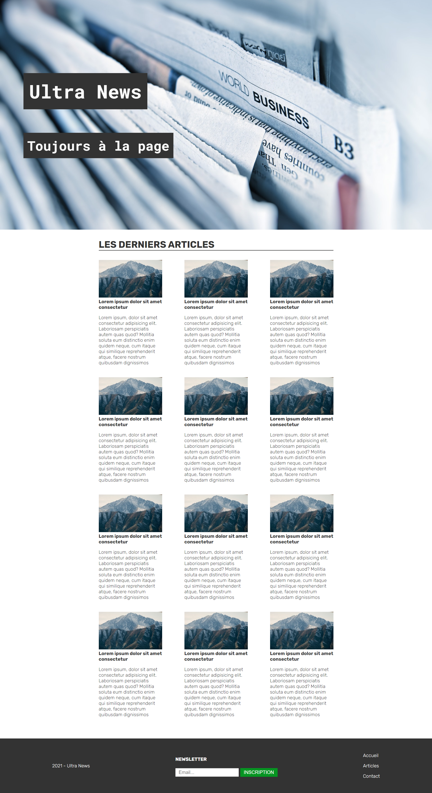
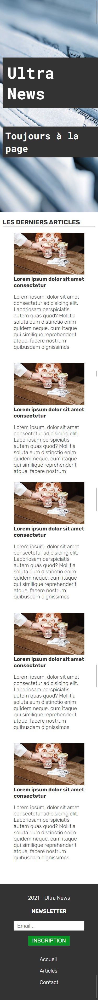
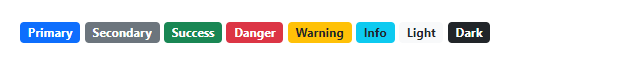

# My Digital School - Partiel HTML/CSS/JS

Vous allez réaliser la maquette d'un site d'informations.

> Vous aurez 2 pages à réaliser. La première aura un modèle imposé et pour la seconde, vous devrez faire apparaître des informations mais le modèle sera libre

## Spécifications générales

- Taille de police de base : 20px
- Couleur de police et d'arrière-plan de titres utilisée : #333
- Fonts Google suggérées : Roboto Mono et Rubik
- Dans l'image d'exemple donnée, des règles ont été définies à `max-width: 900px` et `max-width: 550px` pour les media queries
- Tailles des images pour la liste des articles : 270x160 (pixels)
- Largeur maximale des contenus : 1000px

## Page d'accueil

La page d'accueil affichera un élément de bienvenue prenant tout l'écran de l'utilisateur.

Dans cet élément, un titre de premier niveau et un titre secondaire apparaîtront et pourront changer de couleur au passage de la souris :

Aucun menu n'aura besoin d'apparaître dans cette partie de la page.

Ensuite, l'utilisateur pourra scroller pour trouver une liste des 12 derniers articles.

Ces articles seront affichés en grille, avec 3 articles par ligne en version bureau. Une adaptation mobile sera prévue pour n'afficher que 2 ou 1 article par ligne, au besoin.

Enfin, un footer sera présent en bas de page, avec un formulaire d'inscription à une newsletter, et un menu secondaire présentant trois éléments :

- Accueil
- Articles
- Contact

> Note : la page de contact n'est pas obligatoire, elle est en bonus

## Modèle de réalisation de la page d'accueil

### Version bureau

### Version mobile (avec quelques articles en moins pour la liste)

## Javascript

Lors du clic sur "Inscription", une modale s'affichera avec un message de confirmation :

## Page article

La page d'un article seul est **complètement libre**.

Voici les spécifications générales :

- Faire apparaître un menu principal
- Les informations apparaissant pour l'article seront les suivantes :
  - Nom
  - Image (format assez large, comme une image d'en-tête)
  - Date
  - Liste de tags, par exemple : 
  - Auteur :
    - Nom et photo de profil en petit, par exemple :
      
  - Contenu :
    - Les contenus doivent présenter des paragraphes, des images, des listes, et différents niveaux de titres, sous-titres, sections, etc...
- La page d'article contiendra également un footer
